<p align="center">
  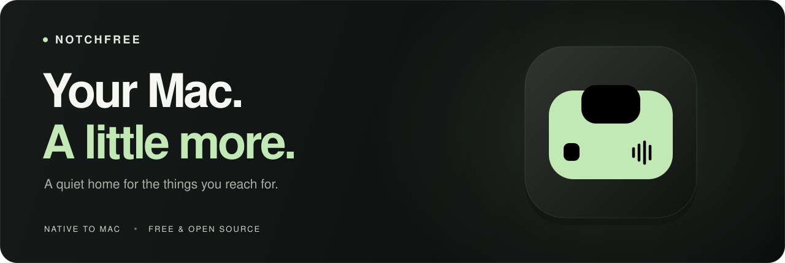
</p>

<p align="center">
  Your music, your next meeting, that file you need.<br>
  <strong>Right at the top of your Mac.</strong>
</p>

<p align="center">
  <a href="https://github.com/dsvyro1414-lab/notchfree/actions/workflows/check.yml"></a>
  <a href="#install"></a>
  <a href="Package.swift"></a>
  <a href="LICENSE"></a>
  <a href="docs/VALIDATION.md"></a>
</p>

<p align="center">
  <a href="#a-little-space-for-everything"><strong>Explore</strong></a> ·
  <a href="#install"><strong>Install</strong></a> ·
  <a href="docs/USER_GUIDE.md"><strong>User guide</strong></a> ·
  <a href="#build-something-with-us"><strong>Contribute</strong></a>
</p>

<br>

<p align="center">
  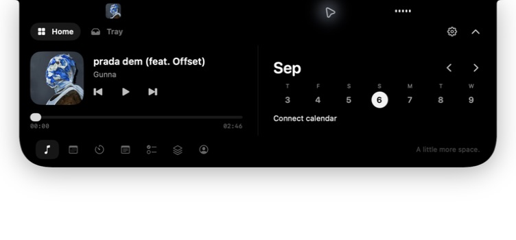
  <br>
  <sub>Music and your week, one glance away.</sub>
</p>

**NotchFree** turns the top of your display into a quiet home for the things you reach for all day. Hover to open, switch a widget, drop a file, then get back to what you were doing. Built natively with **SwiftUI and AppKit**, around a MacBook notch or at the top center of a display without one.

**Free and open source. No subscription. No API key.** Your notes, tasks, timer and tray are stored on your Mac.

> [!NOTE]
> **This is a source alpha.** Install by building on your Mac. There is no prebuilt, Developer ID signed or notarized download. Apple Silicon is the primary validation platform; see [tested and pending scenarios](docs/VALIDATION.md).

## A little space for everything

<table>
  <tr>
    <td width="50%" valign="top">
      <h3>Find your focus</h3>
      <p>Set hours, minutes and seconds directly, or pick a quick preset. Pause, resume and reset a session that survives sleep and relaunch.</p>
      <a href="docs/images/timer.jpg">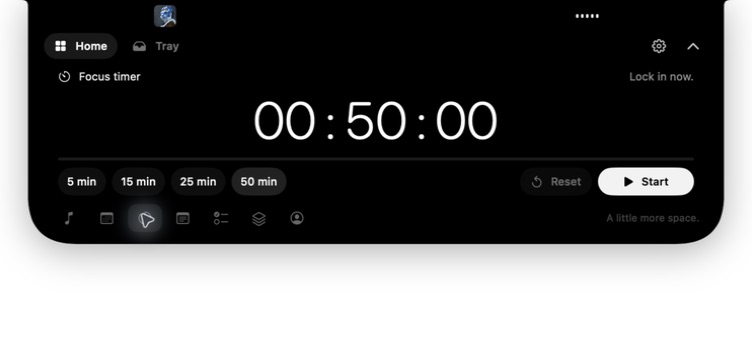</a>
    </td>
    <td width="50%" valign="top">
      <h3>A stop along the way</h3>
      <p>Drop files into Tray, then pick them up in another app. Keep copies across restarts, preview with Quick Look or open the AirDrop picker.</p>
      <a href="docs/images/tray.jpg">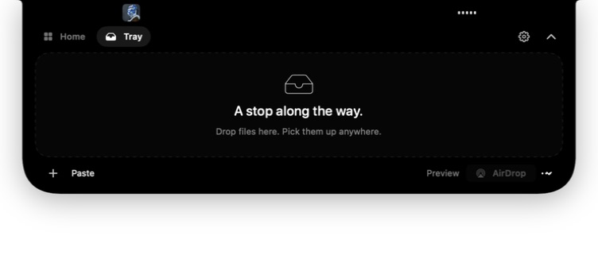</a>
    </td>
  </tr>
  <tr>
    <td width="50%" valign="top">
      <h3>Catch the thought</h3>
      <p>A quick note for the idea you don't want to lose. Automatically saved locally, ready when you come back.</p>
      <a href="docs/images/notes.jpg">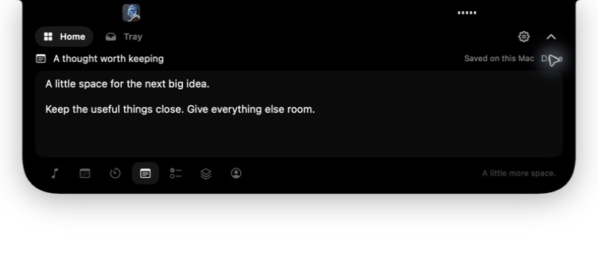</a>
    </td>
    <td width="50%" valign="top">
      <h3>One small thing at a time</h3>
      <p>Add tasks, star what matters and mark things done. Completed tasks stay in their own view and can be restored.</p>
      <a href="docs/images/tasks.jpg">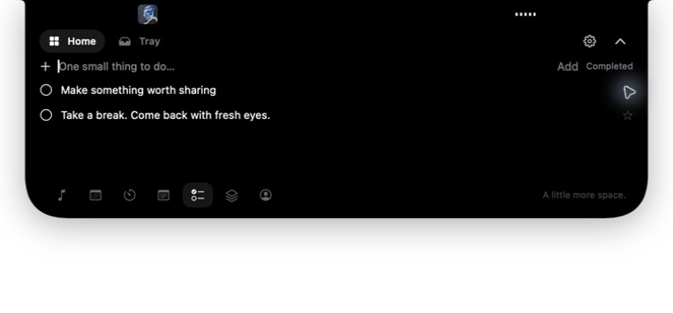</a>
    </td>
  </tr>
  <tr>
    <td width="50%" valign="top">
      <h3>Keep your week close</h3>
      <p>Browse days and weeks. Connect selected calendars to see upcoming meetings, with read-only event access.</p>
      <a href="docs/images/calendar.jpg">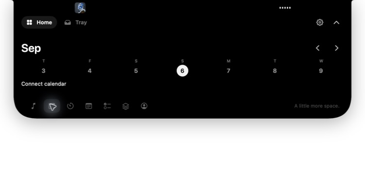</a>
    </td>
    <td width="50%" valign="top">
      <h3>A moment before the call</h3>
      <p>Open a camera mirror when you need it. Capture stops when the mirror or panel closes; video is not recorded.</p>
      <a href="docs/images/mirror.jpg">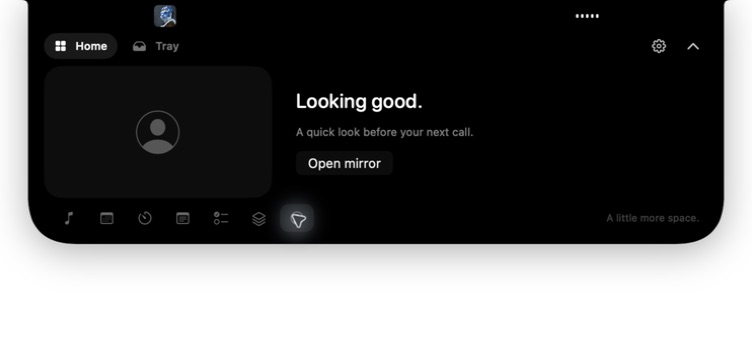</a>
    </td>
  </tr>
</table>

<sub>Actual app captures. Notes and Tasks use temporary sample content. Calendar and Mirror are shown before permission is granted. Click a screenshot to view it at full size.</sub>

<details>
<summary><strong>Shortcuts, music sources and the smaller details</strong></summary>

<br>

<p align="center">
  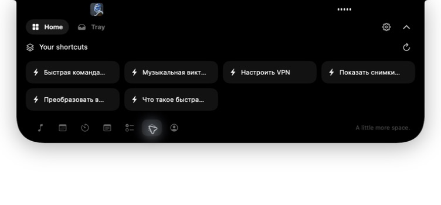
</p>

- **Your existing Shortcuts:** run actions from Apple's Shortcuts app. Their names keep their original language; their own permissions and side effects still apply.
- **Three music sources:** system Now Playing, direct Apple Music and direct Spotify modes. Available album artwork appears in the player and compact strip. Browser support depends on the player publishing a system media session.
- **A compact strip:** available artwork, playback indicators, timer or tray status stay close when the panel is closed.
- **Top-strip gestures:** swipe down/up to open/close. Swipe horizontally to change tracks while closed, or switch Home/Tray while open.
- **Optional system controls:** volume and built-in brightness indicators, battery activity and Bluetooth connection alerts, subject to device support.
- **Native touches:** haptic feedback, macOS Reduce Motion, configurable displays and a menu-bar entry for Open, Settings and Quit.

See the [user guide](docs/USER_GUIDE.md#make-room) for the full behavior and controls.

</details>

## Make it yours

Choose **Green, Blue, Purple, Pink, Orange or White**. Accent changes apply immediately and persist after relaunch. Arrange the widget dock, set the panel width and choose where it appears.

<p align="center">
  <a href="docs/images/appearance.jpg">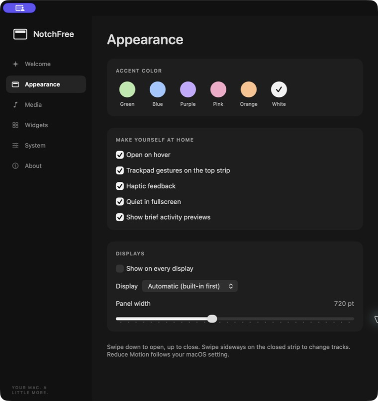</a>
</p>

## Install

You need **macOS 14.6+** and Apple build tools with **Swift 6.0+**. The installer builds for your Mac's architecture; Intel hardware has not been validated. No paid Apple Developer account is required.

**1. Install Apple's Command Line Tools**, if needed, and finish the installer:

```sh
xcode-select --install
```

**2. Check the Swift version**, then clone and install:

```sh
swift --version # Must be 6.0 or newer
git clone https://github.com/dsvyro1414-lab/notchfree.git
cd notchfree
./scripts/install.sh
```

The script builds an optimized app and its vendored media helper, applies a local **ad-hoc signature**, installs **`~/Applications/NotchFree.app`** and opens it. The first build can take a few minutes. It does not require `sudo` or change Gatekeeper settings.

Prefer a ZIP? Choose **Code → Download ZIP**, unzip it, open Terminal in that folder and run `./scripts/install.sh`. [Step-by-step instructions →](docs/USER_GUIDE.md#install)

### Your first minute

1. **Hover at the top center** of your display to open NotchFree. The menu-bar icon can open it too.
2. **Choose a widget** using the bottom dock, or switch to **Tray** for files.
3. **Connect only what you use** in Settings. Calendar, Camera, Automation and other integrations are optional.

Click the top strip to close. Pressing **Escape** closes a focused panel; when editing the timer, the first Escape cancels the draft.

## Local by default. Permissions by choice.

Notes, tasks, timer state and tray copies live in `~/Library/Application Support/NotchFree`. Media artwork may be fetched from the selected player's artwork URL. There is no account or API key to configure.

| If you want… | Enable… |
| :--- | :--- |
| Calendar events | Calendars access through **Connect Calendar** |
| A camera mirror | Camera access through **Open mirror** |
| Direct Apple Music / Spotify control | Automation for the chosen player |
| Keyboard volume / brightness indicators | Accessibility through **Settings → System** |
| Bluetooth connection alerts | Bluetooth in **Settings → System**, if macOS requests access |

Full Disk Access, Screen Recording and Microphone access are not required for the implemented app features. [Permission setup and details →](docs/USER_GUIDE.md#optional-permissions)

<details>
<summary><strong>Compatibility and current limits</strong></summary>

- System-wide media and built-in display brightness use private macOS interfaces that may change after an OS update.
- Browser media support depends on the player. Direct Spotify playback still needs an authenticated live validation pass.
- AirDrop delivery, active camera capture, permission-granted calendars, external displays and other hardware paths have a [separate acceptance checklist](docs/VALIDATION.md#hardware-acceptance-checklist).
- External-display DDC brightness, keyboard backlight indicators, lock-screen widgets and device-specific AirPods battery reporting are not included.
- Rebuilding changes the local signature and may require granting permissions again. Use one installed copy of the app.

[Full troubleshooting guide →](docs/USER_GUIDE.md#compatibility-and-troubleshooting)

</details>

## Build something with us

NotchFree is a small native codebase with a Foundation-only core and focused system adapters.

| Directory | What's inside |
| :--- | :--- |
| [`Sources/NotchFree`](Sources/NotchFree) | SwiftUI interface, AppKit panel, media and system integrations |
| [`Sources/NotchFreeCore`](Sources/NotchFreeCore) | State, persistence, timer, panel geometry and media decoding |
| [`Sources/NotchFreeChecks`](Sources/NotchFreeChecks) | 114 deterministic state, storage and file-operation checks |
| [`Vendor/MediaRemoteAdapter`](Vendor/MediaRemoteAdapter) | Pinned Objective-C source for system Now Playing |

```sh
./script/build_and_run.sh          # Build, bundle, sign and launch locally
./scripts/check.sh                 # Run the deterministic checks
CONFIGURATION=release ./scripts/build.sh
```

CI runs the core checks, builds the app and verifies its local signature. Hardware and provider validation are tracked separately.

Bug reports and pull requests are welcome. Include your macOS version, Mac model, reproduction steps and relevant logs with private information removed. Run `./scripts/check.sh` and `./scripts/build.sh` for code changes, and describe which real app behavior you checked.

<p>
  <a href="https://github.com/dsvyro1414-lab/notchfree/issues">Report an issue</a> ·
  <a href="docs/USER_GUIDE.md#develop">Development guide</a> ·
  <a href="docs/VALIDATION.md">Validation</a> ·
  <a href="docs/USER_GUIDE.md#update">Update</a> ·
  <a href="docs/USER_GUIDE.md#uninstall">Uninstall</a>
</p>

---

<p align="center">
  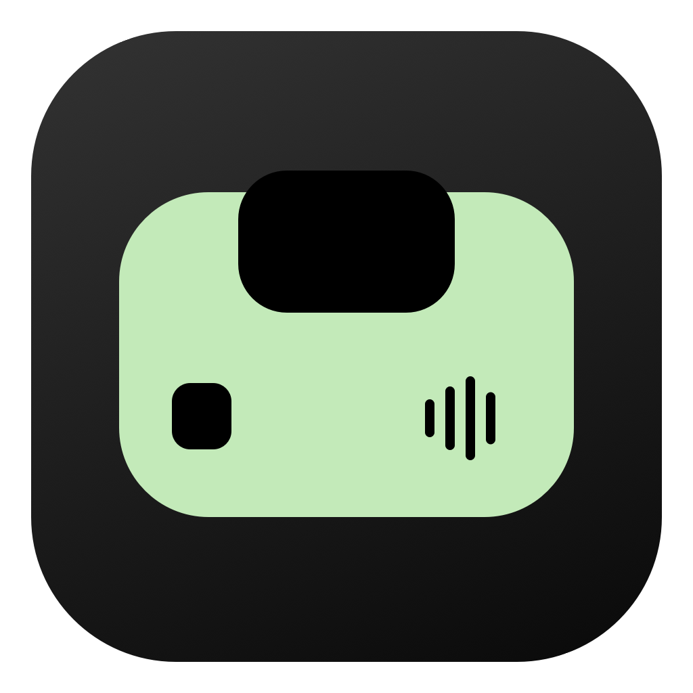<br>
  <strong>A little more space. Open to everyone.</strong><br>
  <sub>NotchFree is <a href="LICENSE">MIT licensed</a>. MediaRemote Adapter is BSD 3-Clause — <a href="THIRD_PARTY_LICENSES.md">credits and licenses</a>.<br>
  An independent project inspired by NotchNook. Not affiliated with NotchNook or Apple.</sub>
</p>
