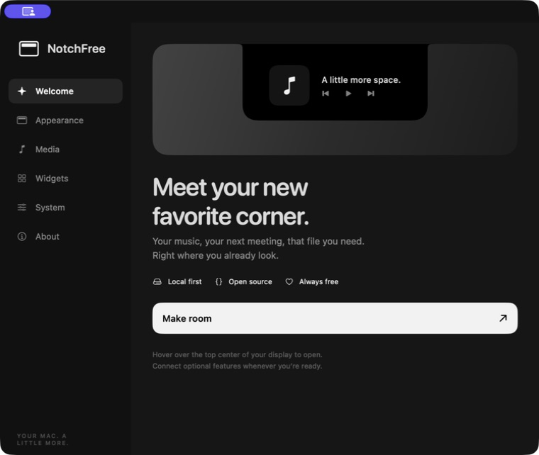

# NotchFree user guide

[← Back to the overview](../README.md)

<p align="center">
  
</p>

**Your music, your next meeting, that file you need. Right at the top of your Mac.**

An independent, free and open-source notch companion inspired by NotchNook. Built natively with SwiftUI and AppKit. Works around a MacBook notch or as a small top-center panel on a display without one.

> **Source alpha.** You build the app on your own Mac. No paid Apple Developer account, subscription or API key is needed. This project does not distribute a Developer ID signed or notarized download.

## Install

You need **macOS 14.6 or later**, Apple Command Line Tools with **Swift 6.0+**, and an internet connection to download the project/tools. Apple Silicon is the primary validation platform. The installer builds for the architecture of your Mac; Intel hardware has not been validated.

1. Install Apple's build tools if you don't have them. In Terminal, run:

   ```sh
   xcode-select --install
   ```

   Complete Apple's installer. If Terminal says the tools are already installed, continue. Check `swift --version` reports version 6.0 or newer. Full Xcode also works; no Apple Developer membership is required.

2. On this GitHub page, click **Code → Download ZIP**, then unzip it. You can also clone this repository using the URL in the Code menu.

3. Open Terminal, type `cd ` (including the space), drag the unzipped project folder into Terminal, and press Return.

4. Run:

   ```sh
   ./scripts/install.sh
   ```

The script compiles NotchFree and its vendored media helper, signs them locally with an **ad-hoc signature**, and installs `~/Applications/NotchFree.app`. It opens the app when done. It does not need `sudo`, change Gatekeeper settings, or download prebuilt helper executables. The first compilation can take a few minutes.

Ad-hoc signing is local code signing, **not** Apple notarization. macOS privacy permissions still apply. If macOS blocks a downloaded source folder or build, review the message in **System Settings → Privacy & Security**; the installer does not disable security protections.

## Make room

- Hover over the top center of your screen to open the panel. Click the top strip or press Escape while the panel has focus to close it.
- Use **Home** for widgets and **Tray** for files. The icons along the bottom switch widgets.
- Swipe down/up on the **top strip** to open/close. Swipe horizontally while closed to change tracks; while open, to switch Home/Tray. Scrolling inside a widget behaves normally.
- The menu-bar icon always provides **Open**, **Settings** and **Quit**.

### Music

**Now Playing** follows the active system media session. The player shows available artwork, title, artist, transport controls and a seek bar when duration is available. Browser playback works only when the browser/player publishes a system Now Playing session.

Select **Apple Music** or **Spotify** in Settings → Media for direct Automation-based integration. Open the chosen player first, then allow the macOS Automation prompt. Playback bars are an animated play/pause indicator, not a recording or frequency analysis of system audio.

Direct Music and Spotify modes load album artwork for both the player and the compact strip. Covers stay in place during pause/seek and update when the track changes. Missing artwork is retried; tracks without a cover keep the music-note placeholder.

Direct integrations wait one second between playback checks while the selected player is running, or two seconds while it is closed. The system Now Playing integration receives updates directly.

### Files and AirDrop

Drop files or folders onto the notch, add them with **+**, or use **Paste**. The tray keeps its own copies across restarts; your original files stay in place. Hold **Option while dropping**, when the source supports moving, to move instead of copy.

Select files with a click (Command-click for multiple). Drag the selection out to Finder or another app to copy it. Right-click for Quick Look, Open, Show in Finder, Copy, AirDrop or Remove. Removing a tray item sends **the tray copy** to the Mac Trash. AirDrop opens Apple's recipient picker; nothing is sent until you choose a recipient. The ellipsis menu can AirDrop clipboard text or a web link.

### Widgets

- **Calendar:** select a day, browse weeks, choose calendars and show upcoming meetings. Access is used to read events; NotchFree does not edit calendars.
- **Timer:** click the centered hours, minutes or seconds to enter a duration, or choose 5 / 15 / 25 / 50 min. Start, pause, resume or reset your focus session; short motivational captions follow its state. Its saved deadline survives sleep and app restarts. A completion sound requires the app to be running; after a quit it catches up on the next launch.
- **Notes:** a local quick note, automatically saved. Click Done to let the panel close when the pointer leaves.
- **Tasks:** add, favorite and complete tasks. Completed items move to the Completed view; you can restore them.
- **Shortcuts:** run shortcuts already present in Apple's Shortcuts app. Their own permissions and side effects still apply.
- **Mirror:** click Open mirror, choose a camera and check your preview. Camera capture stops when the mirror/panel closes; video is not recorded.

Configure the widget dock, hover, haptics, width and display behavior in Settings. Reduce Motion follows macOS.

Settings → Appearance → **Accent color** offers Green, Blue, Purple, Pink, Orange and White. Changes apply immediately and survive relaunch. The expanded section is 212 pt high (244 pt including a 32 pt notch strip), with the same default 720 pt width, text and control sizes. Messages get extra room when needed.

### Focus timer

Click a number in **HH:MM:SS** to select and replace it. **Tab** moves between fields, **Return** confirms without starting, and **Escape** cancels the draft; a second Escape closes the panel. Editing keeps the panel open when the pointer leaves. Enter a duration from **00:00:01 to 23:59:59**; invalid drafts are never saved.

Pause before changing the remaining time or selecting a preset. The new value becomes the selected duration for both progress and Reset, and remains paused until Resume. Reset restores that duration; Start again repeats it after completion. Closing or relaunching the app preserves the timer's saved state.

The app's interface, dates and error guidance use English. Your time zone, notes, filenames, track names and calendar content keep their original values. macOS-owned permission and sharing dialogs may follow the system language.

## Optional permissions

| Feature | Permission / setup |
| --- | --- |
| Calendar | Click Connect Calendar; grant Calendars access |
| Mirror | Click Open mirror; grant Camera access |
| Music / Spotify direct mode | Grant Automation access for that player |
| Replace keyboard volume/brightness HUD | Settings → System → Enable notch keyboard indicators; grant Accessibility, then click Enable again |
| Bluetooth alerts | Enable in Settings → System; grant Bluetooth access if macOS requests it |
| Launch at login | Enable in Settings → System after installing |

Each is optional. You do not need Full Disk Access, Screen Recording, or Microphone access for the implemented features.

## Compatibility and troubleshooting

- System-wide media uses a **private macOS API** through MediaRemote Adapter. It may change in an OS update. Use Reconnect or the Music/Spotify modes if unavailable.
- Brightness uses a private DisplayServices interface and targets the built-in display. Unsupported displays retain their normal behavior. HDMI/USB audio devices may not expose software volume or mute.
- Replacing keyboard HUDs needs Accessibility. If interception or a device operation fails, the event is passed back to macOS. External brightness/DDC, keyboard backlight HUDs and lock-screen widgets are not included.
- Bluetooth notifications cover devices exposed by macOS IOBluetooth; device-specific AirPods battery reporting is not included.
- Fullscreen detection uses visible window geometry. Unusual third-party fullscreen windows may behave differently; turn off Quiet in fullscreen if needed. The panel remains available by hover or the menu-bar command.
- A **rebuild changes the local signature**. If a previously working permission stops working after an update, quit NotchFree, remove/re-add the installed app in the relevant Privacy & Security permission list, then launch that same installed copy. Avoid running multiple builds at once.
- If note/task storage is damaged, the app attempts its last valid backup. If both files are unreadable, it preserves them and displays an error instead of silently saving empty data.
- A successful build is not a hardware compatibility guarantee. See [the validation checklist](VALIDATION.md) for tested vs. pending scenarios.

## Update

Quit NotchFree. Download the latest source ZIP again (or `git pull` inside your clone), then run `./scripts/install.sh` from that folder. The installer replaces only the verified NotchFree app; your settings, notes, tasks and tray remain in place. If the install fails, it restores the previous app.

## Uninstall

Turn off Launch at login in NotchFree Settings, quit, then move `~/Applications/NotchFree.app` to Trash. To also remove your data, use Finder → Go → Go to Folder and open:

```text
~/Library/Application Support/NotchFree
```

Review that folder before moving it to Trash: it includes notes, tasks, timer state and tray copies (including files explicitly moved into the tray).

## Develop

```sh
./script/build_and_run.sh            # debug build, bundle, sign, launch
./script/build_and_run.sh --verify   # also verify a running process
./script/build_and_run.sh --relaunch # reuse an existing bundle without rebuilding
./script/build_and_run.sh --logs     # launch and stream app logs
./scripts/check.sh                  # deterministic core/storage checks
```

`CONFIGURATION=release ./scripts/build.sh` builds an optimized local bundle in `dist/NotchFree.app`. Installation also uses a release build by default. The installer removes the staging app after a successful install to avoid duplicate app identities.

Architecture: `NotchFreeCore` holds Foundation-only state, persistence, timer and media decoding. `NotchFree` holds SwiftUI views and AppKit/system adapters. `NotchFreeChecks` runs actual file-operation and state checks without requiring XCTest/full Xcode. CI builds the bundle and runs the same checks.

## License

NotchFree code: [MIT](../LICENSE). MediaRemote Adapter: BSD 3-Clause, vendored at a pinned revision; see [third-party licenses](../THIRD_PARTY_LICENSES.md). Not affiliated with NotchNook or Apple.
